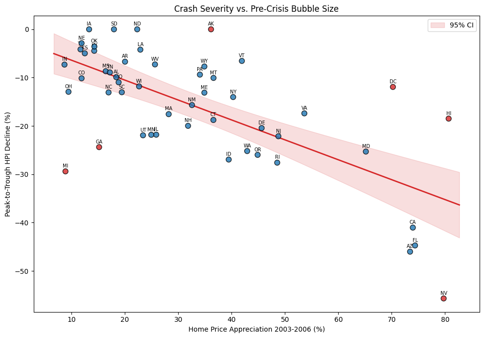

# What Predicted the 2008 Housing Crash?

State-level regression analysis of the 2008 housing crisis. We use FRED economic data (house price index, unemployment, income, population) for all 50 states plus DC to test whether the crash was purely a bubble deflation or whether pre-crisis economic fundamentals determined which states were resilient. The analysis includes OLS regression, permutation testing, and an LLM prediction experiment with contamination control.

[Read the full report (PDF)](final_project.pdf)
